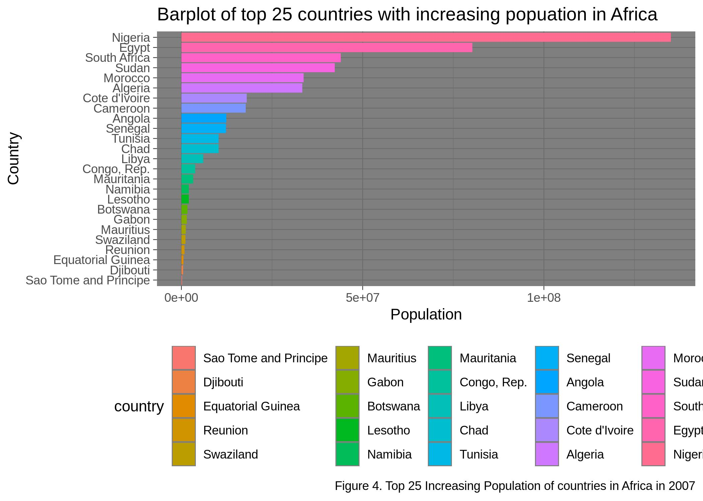

```{r setup, include=FALSE}
knitr::opts_chunk$set(echo = TRUE)
```

# Introduction

In this assignment, I will attempt to do the following tasks:

* Reorder a factor in a principled way based on the data and demonstrate the effect in arranged data and in figures.
* Write some data to file and load it back into R.
* Improve a figure (or make one from scratch), using new knowledge, e.g., control the color scheme, use factor levels, smoother mechanics.
* Make a plotly visual.
* Implement visualization design principles.
* Save a figure to file, and read it from file as well.

## Load in required libraries

First we will load in all the libraries we will be using for this assignment.
```{r}
library(gapminder)
suppressMessages(library("tidyverse"))
library(knitr)
library(plotly)
```


## Part 1: Factor management

### Elaboration for the gapminder data set

For this section, I will do the following:

* Drop the ocenia factor variable
* Remove unused factor level
* Provide concrete information on the data before and after removing these rows and Oceania and addressing the number of rows and the levels of the affected factors. 
* Reorder the levels of country or continent
### Drop the oceania variable
```{r}
gap_new <- filter(gapminder, continent %in% c("Americas", "Africa", "Asia", "Europe"))

#show the difference between the original and the filtered dataframe
#the original
cat("The Original\n")
str(gapminder)
cat("The filtered\n")
str(gap_new)
```

As we can see, the filtering worked. Comparing the original to the filtered we have reduced the data size by removing $24$ observations relating to Oceania.

### Remove unused factor level
```{r}
#drop the levels for Oceania
gap_drop_levels <- droplevels(gap_new)
#output the resulting dataset
str(gap_drop_levels)
```

Looking at the result above, we see that `droplevels()` function drops unused factor levels in both `country` and `continent`.

### Data summary before and after removing Oceania

* Dataset before `Oceania` is filtered out:
```{r}
kable(summary(gapminder))
```

* Dataset after `Oceania` observations are filtered out:
```{r}
kable(summary(gap_new))
```

* Dataset after droping `Oceania` level
```{r}
kable(summary(gap_drop_levels))
```

Looking at the above summaries, we see that we have successfully dropped all observations pertaining to `Oceania` as well as droping the factor level itself.

### Reorder the levels of country or continent

For this part, I will be reordering the levels of countries in `Africa` for the year `2007`.
```{r}
# filter the dataset to only include obseravations found in africa in 2007
gap_africa_2007 <- gapminder %>%
     filter(continent %in% c("Africa"), year == "2007") %>% #filter to only contries in Africa
     droplevels() # drops all factors not pertaining to Africa

#show the dataset
kable(summary(gap_africa_2007))

#count how many unique countries we have
paste("Number of unique countries is: ",nlevels(gap_africa_2007$country))
```

The dataset now only has observations from `Africa` from the year `2007` with `52` unique countries.

### Do some plots to visualize the new dataset

* I will be using a barchart to show how the total population in `Africa` is increasing over time.

```{r}
gap_africa_2007 %>%
    mutate(country = fct_reorder(country, pop)) %>% #order from highest to lowest
    ggplot(aes(country,pop)) +  #create a ggplot object
    geom_bar(aes(fill=country),  stat="identity") + # Give each country a unique color
    coord_flip() + # This helps for easier visualization
    labs(x = "Country", y = "Population", # add labels
        title = "Increasing Population in Africa")
```

* The plot above is somewhat harder to see. So I will plot the top `25` and the remaining `27` separately so it is easier to see.
```{r}
#plot the top 25
gap_africa_2007 %>%
    mutate(country = fct_reorder(country, pop)) %>% #order from highest to lowest
    top_n(25) %>%
    ggplot(aes(country,pop)) +  #create a ggplot object
    geom_bar(aes(fill=country),  stat="identity") + # Give each country a unique color
    coord_flip() + # This helps for easier visualization
    labs(x = "Country", y = "Population", # add labels
        title = "Increasing Population in Africa")
```

* Now that is much easier to see.

* Do the same for the remaning observations
```{r}
#plot the remaining 27
gap_africa_2007 %>%
    mutate(country = fct_reorder(country, pop)) %>% #order from highest to lowest
    top_n(-27) %>%
    ggplot(aes(country,pop)) +  #create a ggplot object
    geom_bar(aes(fill=country),  stat="identity") + # Give each country a unique color
    coord_flip() + # This helps for easier visualization
    labs(x = "Country", y = "Population", # add labels
        title = "Increasing Population in Africa")
```

* By splitting up the plots, we have created a more pleasing visualization of the dataset.

## Part 2: File Import/Export

In this part, I will be doing the following:

* Experiment with `write_csv()/read_csv()`
* Experiment with `saveRDS()/readRDS()`

### Experiment with `write_csv()/read_csv()`

For this part, I will be reordering the `Africa 2007` dataset by increasing population. I will also be reading and writing the resulting files `saveRDS()/readRDS()`.

```{r}
#order the dataframe by increasing population size
gap_africa_2007 <- arrange(gap_africa_2007, pop)

#show a summary
kable(gap_africa_2007, caption = "Table of increasing population in Africa in the year 2007")

#use the write table method to save this table to the current working directory
write_csv(gap_africa_2007,"Africa_2007_Data", col_names = TRUE)

#read it back from the current working directory
data_new <- read_csv("Africa_2007_Data")

#print the table and check that they are the same
kable(data_new, caption = "Table after reading from working directory")
```

* Looking at the results above, we see that after writing the table, and then reading it back in. We get the same results witht the order mantained.

### Experiment with `saveRDS()/readRDS()`

For this part, I will be reordering the `Africa 2007` dataset by increasing population. I will also be reading and writing the resulting files `saveRDS()/readRDS()`.


```{r}
#order the dataframe by increasing population size
gap_africa_2007 <- arrange(gap_africa_2007, gdpPercap)

#show a summary
kable(gap_africa_2007, caption = "Table of increasing gdpPercap in Africa in the year 2007")

#use the saveRDS method to save this table to the current working directory
saveRDS(gap_africa_2007, "Africa_2007_gdpPercap_data.csv")

#read it back from the working directory
data_new.2 <- readRDS("Africa_2007_gdpPercap_data.csv")

#print the table and check that they are the same
kable(data_new.2, caption = "Table after reading from working directory")
```

* Again, looking at the above tables, we see that they have the exact same result. 

## Part 3: Visualization Design

* For this part, I will be taking the plot of the top 25 most populated countries in `Africa` in `2007` and peform some cleaning on it.
* I will change the legend posistion
* I will change the background color
* I will give it a legend as well

```{r}
#plot the top 25
gap_africa_2007 %>%
    mutate(country = fct_reorder(country, pop)) %>% #order from highest to lowest
    top_n(25) %>%
    ggplot(aes(country,pop)) +  #create a ggplot object
    geom_bar(aes(fill=country),  stat="identity") + # Give each country a unique color
    labs(x = "Country", y = "Population", # add some labels and a caption as well
        title = "Barplot of top 25 countries with increasing popuation in Africa",
        color='Legend: Country', caption = "Figure 4. Top 25 Increasing Population of countries in Africa in 2007") +
    theme_dark() + #give it a dark theme
    coord_flip() + # This helps for easier visualization
    theme(legend.position="bottom")  # finally, place the legend at the bottom
```

* Since the above figure can not be processed using `plotly` I will be doing a scatter plot of `gdpPercap` vs `population` and then transforming that into a `plotly` object.

```{r}
#create a plot object
plot_obj <- ggplot(gap_drop_levels, aes(gdpPercap, pop)) + 
      geom_point(aes(colour=lifeExp), alpha=0.1) + #scatter of gdpPercap and population
      scale_x_log10() + #convert the x to log scale
      scale_colour_viridis_c(
        trans   = "log10" #log transformation of our data
      ) +
   facet_wrap(~ continent) +
  labs(x = "GDP per Capita", y = "Population", 
      title = "GDP per Capita vs. Population, by Continent",
      color='LifeExp')

#show the plot
plot_obj

#create a plotly plot
ggplotly(plot_obj)
```

* The above plot may not be the best, but I think it illustrates the `plotly` idea. Also, it won't render in the `.md` file, but it should be in the `html` document.

## Part 4: Writing figures to file

For this part, I will be saving one of my previous figure to file and then reading that same figure.

* I will save in a `jpg` format as well as a `png` format
* I will be using the `ggsave()` functions.

```{r}
#generate the plot
gap_africa_2007 %>%
    mutate(country = fct_reorder(country, pop)) %>% #order from highest to lowest
    top_n(25) %>%
    ggplot(aes(country,pop)) +  #create a ggplot object
    geom_bar(aes(fill=country),  stat="identity") + # Give each country a unique color
    labs(x = "Country", y = "Population", # add some labels and a caption as well
        title = "Barplot of top 25 countries with increasing popuation in Africa",
        color='Legend: Country', caption = "Figure 4. Top 25 Increasing Population of countries in Africa in 2007") +
    theme_dark() + #give it a dark theme
    coord_flip() + # This helps for easier visualization
    theme(legend.position="bottom")  # finally, place the legend at the bottom

#save it in a jpg format
ggsave("Population_plot.jpg")

#save it in a png format
ggsave("Population_plot.png")
```

### Now we can load in the saved figures

* The jpg file


* The png file


