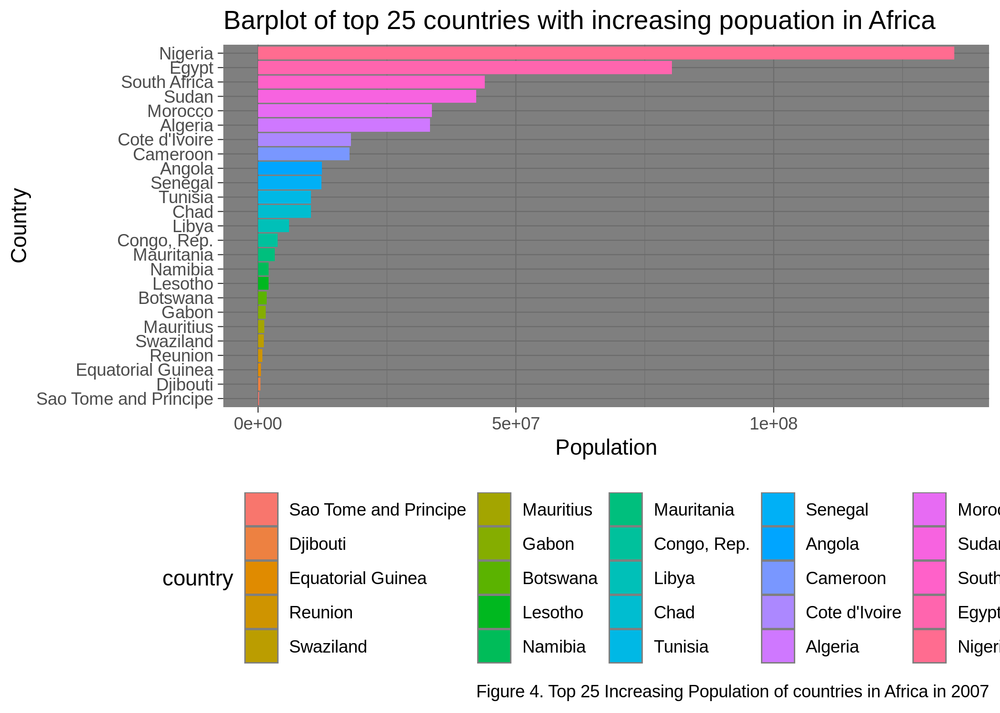

HW 05 Soultions
================
Elijah Willie
October 19, 2018

Introduction
============

In this assignment, I will attempt to do the following tasks:

-   Reorder a factor in a principled way based on the data and demonstrate the effect in arranged data and in figures.
-   Write some data to file and load it back into R.
-   Improve a figure (or make one from scratch), using new knowledge, e.g., control the color scheme, use factor levels, smoother mechanics.
-   Make a plotly visual.
-   Implement visualization design principles.
-   Save a figure to file, and read it from file as well.

Load in required libraries
--------------------------

First we will load in all the libraries we will be using for this assignment.

``` r
library(gapminder)
suppressMessages(library("tidyverse"))
library(knitr)
library(plotly)
```

    ## 
    ## Attaching package: 'plotly'

    ## The following object is masked from 'package:ggplot2':
    ## 
    ##     last_plot

    ## The following object is masked from 'package:stats':
    ## 
    ##     filter

    ## The following object is masked from 'package:graphics':
    ## 
    ##     layout

Part 1: Factor management
-------------------------

### Elaboration for the gapminder data set

For this section, I will do the following:

-   Drop the ocenia factor variable
-   Remove unused factor level
-   Provide concrete information on the data before and after removing these rows and Oceania and addressing the number of rows and the levels of the affected factors.
-   Reorder the levels of country or continent \#\#\# Drop the oceania variable

``` r
gap_new <- filter(gapminder, continent %in% c("Americas", "Africa", "Asia", "Europe"))

#show the difference between the original and the filtered dataframe
#the original
cat("The Original\n")
```

    ## The Original

``` r
str(gapminder)
```

    ## Classes 'tbl_df', 'tbl' and 'data.frame':    1704 obs. of  6 variables:
    ##  $ country  : Factor w/ 142 levels "Afghanistan",..: 1 1 1 1 1 1 1 1 1 1 ...
    ##  $ continent: Factor w/ 5 levels "Africa","Americas",..: 3 3 3 3 3 3 3 3 3 3 ...
    ##  $ year     : int  1952 1957 1962 1967 1972 1977 1982 1987 1992 1997 ...
    ##  $ lifeExp  : num  28.8 30.3 32 34 36.1 ...
    ##  $ pop      : int  8425333 9240934 10267083 11537966 13079460 14880372 12881816 13867957 16317921 22227415 ...
    ##  $ gdpPercap: num  779 821 853 836 740 ...

``` r
cat("The filtered\n")
```

    ## The filtered

``` r
str(gap_new)
```

    ## Classes 'tbl_df', 'tbl' and 'data.frame':    1680 obs. of  6 variables:
    ##  $ country  : Factor w/ 142 levels "Afghanistan",..: 1 1 1 1 1 1 1 1 1 1 ...
    ##  $ continent: Factor w/ 5 levels "Africa","Americas",..: 3 3 3 3 3 3 3 3 3 3 ...
    ##  $ year     : int  1952 1957 1962 1967 1972 1977 1982 1987 1992 1997 ...
    ##  $ lifeExp  : num  28.8 30.3 32 34 36.1 ...
    ##  $ pop      : int  8425333 9240934 10267083 11537966 13079460 14880372 12881816 13867957 16317921 22227415 ...
    ##  $ gdpPercap: num  779 821 853 836 740 ...

As we can see, the filtering worked. Comparing the original to the filtered we have reduced the data size by removing 24 observations relating to Oceania.

### Remove unused factor level

``` r
#drop the levels for Oceania
gap_drop_levels <- droplevels(gap_new)
#output the resulting dataset
str(gap_drop_levels)
```

    ## Classes 'tbl_df', 'tbl' and 'data.frame':    1680 obs. of  6 variables:
    ##  $ country  : Factor w/ 140 levels "Afghanistan",..: 1 1 1 1 1 1 1 1 1 1 ...
    ##  $ continent: Factor w/ 4 levels "Africa","Americas",..: 3 3 3 3 3 3 3 3 3 3 ...
    ##  $ year     : int  1952 1957 1962 1967 1972 1977 1982 1987 1992 1997 ...
    ##  $ lifeExp  : num  28.8 30.3 32 34 36.1 ...
    ##  $ pop      : int  8425333 9240934 10267083 11537966 13079460 14880372 12881816 13867957 16317921 22227415 ...
    ##  $ gdpPercap: num  779 821 853 836 740 ...

Looking at the result above, we see that `droplevels()` function drops unused factor levels in both `country` and `continent`.

### Data summary before and after removing Oceania

-   Dataset before `Oceania` is filtered out:

``` r
kable(summary(gapminder))
```

|     |     country     |   continent  |     year     |    lifeExp    |        pop        |    gdpPercap    |
|-----|:---------------:|:------------:|:------------:|:-------------:|:-----------------:|:---------------:|
|     | Afghanistan: 12 |  Africa :624 |  Min. :1952  |  Min. :23.60  |  Min. :6.001e+04  |   Min. : 241.2  |
|     |   Albania : 12  | Americas:300 | 1st Qu.:1966 | 1st Qu.:48.20 | 1st Qu.:2.794e+06 | 1st Qu.: 1202.1 |
|     |   Algeria : 12  |   Asia :396  | Median :1980 | Median :60.71 | Median :7.024e+06 | Median : 3531.8 |
|     |   Angola : 12   |  Europe :360 |  Mean :1980  |  Mean :59.47  |  Mean :2.960e+07  |  Mean : 7215.3  |
|     |  Argentina : 12 | Oceania : 24 | 3rd Qu.:1993 | 3rd Qu.:70.85 | 3rd Qu.:1.959e+07 | 3rd Qu.: 9325.5 |
|     |  Australia : 12 |      NA      |  Max. :2007  |  Max. :82.60  |  Max. :1.319e+09  |  Max. :113523.1 |
|     |  (Other) :1632  |      NA      |      NA      |       NA      |         NA        |        NA       |

-   Dataset after `Oceania` observations are filtered out:

``` r
kable(summary(gap_new))
```

|     |     country     |   continent  |     year     |    lifeExp    |        pop        |    gdpPercap    |
|-----|:---------------:|:------------:|:------------:|:-------------:|:-----------------:|:---------------:|
|     | Afghanistan: 12 |  Africa :624 |  Min. :1952  |  Min. :23.60  |  Min. :6.001e+04  |   Min. : 241.2  |
|     |   Albania : 12  | Americas:300 | 1st Qu.:1966 | 1st Qu.:48.08 | 1st Qu.:2.780e+06 | 1st Qu.: 1189.1 |
|     |   Algeria : 12  |   Asia :396  | Median :1980 | Median :60.34 | Median :7.024e+06 | Median : 3449.5 |
|     |   Angola : 12   |  Europe :360 |  Mean :1980  |  Mean :59.26  |  Mean :2.990e+07  |  Mean : 7052.4  |
|     |  Argentina : 12 |  Oceania : 0 | 3rd Qu.:1993 | 3rd Qu.:70.75 | 3rd Qu.:1.987e+07 | 3rd Qu.: 8943.2 |
|     |   Austria : 12  |      NA      |  Max. :2007  |  Max. :82.60  |  Max. :1.319e+09  |  Max. :113523.1 |
|     |  (Other) :1608  |      NA      |      NA      |       NA      |         NA        |        NA       |

-   Dataset after droping `Oceania` level

``` r
kable(summary(gap_drop_levels))
```

|     |     country     |   continent  |     year     |    lifeExp    |        pop        |    gdpPercap    |
|-----|:---------------:|:------------:|:------------:|:-------------:|:-----------------:|:---------------:|
|     | Afghanistan: 12 |  Africa :624 |  Min. :1952  |  Min. :23.60  |  Min. :6.001e+04  |   Min. : 241.2  |
|     |   Albania : 12  | Americas:300 | 1st Qu.:1966 | 1st Qu.:48.08 | 1st Qu.:2.780e+06 | 1st Qu.: 1189.1 |
|     |   Algeria : 12  |   Asia :396  | Median :1980 | Median :60.34 | Median :7.024e+06 | Median : 3449.5 |
|     |   Angola : 12   |  Europe :360 |  Mean :1980  |  Mean :59.26  |  Mean :2.990e+07  |  Mean : 7052.4  |
|     |  Argentina : 12 |      NA      | 3rd Qu.:1993 | 3rd Qu.:70.75 | 3rd Qu.:1.987e+07 | 3rd Qu.: 8943.2 |
|     |   Austria : 12  |      NA      |  Max. :2007  |  Max. :82.60  |  Max. :1.319e+09  |  Max. :113523.1 |
|     |  (Other) :1608  |      NA      |      NA      |       NA      |         NA        |        NA       |

Looking at the above summaries, we see that we have successfully dropped all observations pertaining to `Oceania` as well as droping the factor level itself.

### Reorder the levels of country or continent

For this part, I will be reordering the levels of countries in `Africa` for the year `2007`.

``` r
# filter the dataset to only include obseravations found in africa in 2007
gap_africa_2007 <- gapminder %>%
     filter(continent %in% c("Africa"), year == "2007") %>% #filter to only contries in Africa
     droplevels() # drops all factors not pertaining to Africa

#show the dataset
kable(summary(gap_africa_2007))
```

|     |     country     | continent |     year     |    lifeExp    |        pop        |    gdpPercap    |
|-----|:---------------:|:---------:|:------------:|:-------------:|:-----------------:|:---------------:|
|     |   Algeria : 1   | Africa:52 |  Min. :2007  |  Min. :39.61  |   Min. : 199579   |   Min. : 277.6  |
|     |    Angola : 1   |     NA    | 1st Qu.:2007 | 1st Qu.:47.83 |  1st Qu.: 2909226 |  1st Qu.: 863.0 |
|     |    Benin : 1    |     NA    | Median :2007 | Median :52.93 | Median : 10093310 | Median : 1452.3 |
|     |   Botswana : 1  |     NA    |  Mean :2007  |  Mean :54.81  |  Mean : 17875763  |  Mean : 3089.0  |
|     | Burkina Faso: 1 |     NA    | 3rd Qu.:2007 | 3rd Qu.:59.44 | 3rd Qu.: 19363654 | 3rd Qu.: 3993.5 |
|     |   Burundi : 1   |     NA    |  Max. :2007  |  Max. :76.44  |  Max. :135031164  |  Max. :13206.5  |
|     |   (Other) :46   |     NA    |      NA      |       NA      |         NA        |        NA       |

``` r
#count how many unique countries we have
paste("Number of unique countries is: ",nlevels(gap_africa_2007$country))
```

    ## [1] "Number of unique countries is:  52"

The dataset now only has observations from `Africa` from the year `2007` with `52` unique countries.

### Do some plots to visualize the new dataset

-   I will be using a barchart to show how the total population in `Africa` is increasing over time.

``` r
gap_africa_2007 %>%
    mutate(country = fct_reorder(country, pop)) %>% #order from highest to lowest
    ggplot(aes(country,pop)) +  #create a ggplot object
    geom_bar(aes(fill=country),  stat="identity") + # Give each country a unique color
    coord_flip() + # This helps for easier visualization
    labs(x = "Country", y = "Population", # add labels
        title = "Increasing Population in Africa")
```


-   The plot above is somewhat harder to see. So I will plot the top `25` and the remaining `27` separately so it is easier to see.

``` r
#plot the top 25
gap_africa_2007 %>%
    mutate(country = fct_reorder(country, pop)) %>% #order from highest to lowest
    top_n(25) %>%
    ggplot(aes(country,pop)) +  #create a ggplot object
    geom_bar(aes(fill=country),  stat="identity") + # Give each country a unique color
    coord_flip() + # This helps for easier visualization
    labs(x = "Country", y = "Population", # add labels
        title = "Increasing Population in Africa")
```

    ## Selecting by gdpPercap


-   Now that is much easier to see.

-   Do the same for the remaning observations

``` r
#plot the remaining 27
gap_africa_2007 %>%
    mutate(country = fct_reorder(country, pop)) %>% #order from highest to lowest
    top_n(-27) %>%
    ggplot(aes(country,pop)) +  #create a ggplot object
    geom_bar(aes(fill=country),  stat="identity") + # Give each country a unique color
    coord_flip() + # This helps for easier visualization
    labs(x = "Country", y = "Population", # add labels
        title = "Increasing Population in Africa")
```

    ## Selecting by gdpPercap


-   By splitting up the plots, we have created a more pleasing visualization of the dataset.

Part 2: File Import/Export
--------------------------

In this part, I will be doing the following:

-   Experiment with `write_csv()/read_csv()`
-   Experiment with `saveRDS()/readRDS()`

### Experiment with `write_csv()/read_csv()`

For this part, I will be reordering the `Africa 2007` dataset by increasing population. I will also be reading and writing the resulting files `saveRDS()/readRDS()`.

``` r
#order the dataframe by increasing population size
gap_africa_2007 <- arrange(gap_africa_2007, pop)

#show a summary
kable(gap_africa_2007, caption = "Table of increasing population in Africa in the year 2007")
```

| country                  | continent |  year|  lifeExp|        pop|   gdpPercap|
|:-------------------------|:----------|-----:|--------:|----------:|-----------:|
| Sao Tome and Principe    | Africa    |  2007|   65.528|     199579|   1598.4351|
| Djibouti                 | Africa    |  2007|   54.791|     496374|   2082.4816|
| Equatorial Guinea        | Africa    |  2007|   51.579|     551201|  12154.0897|
| Comoros                  | Africa    |  2007|   65.152|     710960|    986.1479|
| Reunion                  | Africa    |  2007|   76.442|     798094|   7670.1226|
| Swaziland                | Africa    |  2007|   39.613|    1133066|   4513.4806|
| Mauritius                | Africa    |  2007|   72.801|    1250882|  10956.9911|
| Gabon                    | Africa    |  2007|   56.735|    1454867|  13206.4845|
| Guinea-Bissau            | Africa    |  2007|   46.388|    1472041|    579.2317|
| Botswana                 | Africa    |  2007|   50.728|    1639131|  12569.8518|
| Gambia                   | Africa    |  2007|   59.448|    1688359|    752.7497|
| Lesotho                  | Africa    |  2007|   42.592|    2012649|   1569.3314|
| Namibia                  | Africa    |  2007|   52.906|    2055080|   4811.0604|
| Liberia                  | Africa    |  2007|   45.678|    3193942|    414.5073|
| Mauritania               | Africa    |  2007|   64.164|    3270065|   1803.1515|
| Congo, Rep.              | Africa    |  2007|   55.322|    3800610|   3632.5578|
| Central African Republic | Africa    |  2007|   44.741|    4369038|    706.0165|
| Eritrea                  | Africa    |  2007|   58.040|    4906585|    641.3695|
| Togo                     | Africa    |  2007|   58.420|    5701579|    882.9699|
| Libya                    | Africa    |  2007|   73.952|    6036914|  12057.4993|
| Sierra Leone             | Africa    |  2007|   42.568|    6144562|    862.5408|
| Benin                    | Africa    |  2007|   56.728|    8078314|   1441.2849|
| Burundi                  | Africa    |  2007|   49.580|    8390505|    430.0707|
| Rwanda                   | Africa    |  2007|   46.242|    8860588|    863.0885|
| Somalia                  | Africa    |  2007|   48.159|    9118773|    926.1411|
| Guinea                   | Africa    |  2007|   56.007|    9947814|    942.6542|
| Chad                     | Africa    |  2007|   50.651|   10238807|   1704.0637|
| Tunisia                  | Africa    |  2007|   73.923|   10276158|   7092.9230|
| Zambia                   | Africa    |  2007|   42.384|   11746035|   1271.2116|
| Mali                     | Africa    |  2007|   54.467|   12031795|   1042.5816|
| Senegal                  | Africa    |  2007|   63.062|   12267493|   1712.4721|
| Zimbabwe                 | Africa    |  2007|   43.487|   12311143|    469.7093|
| Angola                   | Africa    |  2007|   42.731|   12420476|   4797.2313|
| Niger                    | Africa    |  2007|   56.867|   12894865|    619.6769|
| Malawi                   | Africa    |  2007|   48.303|   13327079|    759.3499|
| Burkina Faso             | Africa    |  2007|   52.295|   14326203|   1217.0330|
| Cameroon                 | Africa    |  2007|   50.430|   17696293|   2042.0952|
| Cote d'Ivoire            | Africa    |  2007|   48.328|   18013409|   1544.7501|
| Madagascar               | Africa    |  2007|   59.443|   19167654|   1044.7701|
| Mozambique               | Africa    |  2007|   42.082|   19951656|    823.6856|
| Ghana                    | Africa    |  2007|   60.022|   22873338|   1327.6089|
| Uganda                   | Africa    |  2007|   51.542|   29170398|   1056.3801|
| Algeria                  | Africa    |  2007|   72.301|   33333216|   6223.3675|
| Morocco                  | Africa    |  2007|   71.164|   33757175|   3820.1752|
| Kenya                    | Africa    |  2007|   54.110|   35610177|   1463.2493|
| Tanzania                 | Africa    |  2007|   52.517|   38139640|   1107.4822|
| Sudan                    | Africa    |  2007|   58.556|   42292929|   2602.3950|
| South Africa             | Africa    |  2007|   49.339|   43997828|   9269.6578|
| Congo, Dem. Rep.         | Africa    |  2007|   46.462|   64606759|    277.5519|
| Ethiopia                 | Africa    |  2007|   52.947|   76511887|    690.8056|
| Egypt                    | Africa    |  2007|   71.338|   80264543|   5581.1810|
| Nigeria                  | Africa    |  2007|   46.859|  135031164|   2013.9773|

``` r
#use the write table method to save this table to the current working directory
write_csv(gap_africa_2007,"Africa_2007_Data", col_names = TRUE)

#read it back from the current working directory
data_new <- read_csv("Africa_2007_Data")
```

    ## Parsed with column specification:
    ## cols(
    ##   country = col_character(),
    ##   continent = col_character(),
    ##   year = col_integer(),
    ##   lifeExp = col_double(),
    ##   pop = col_integer(),
    ##   gdpPercap = col_double()
    ## )

``` r
#print the table and check that they are the same
kable(data_new, caption = "Table after reading from working directory")
```

| country                  | continent |  year|  lifeExp|        pop|   gdpPercap|
|:-------------------------|:----------|-----:|--------:|----------:|-----------:|
| Sao Tome and Principe    | Africa    |  2007|   65.528|     199579|   1598.4351|
| Djibouti                 | Africa    |  2007|   54.791|     496374|   2082.4816|
| Equatorial Guinea        | Africa    |  2007|   51.579|     551201|  12154.0897|
| Comoros                  | Africa    |  2007|   65.152|     710960|    986.1479|
| Reunion                  | Africa    |  2007|   76.442|     798094|   7670.1226|
| Swaziland                | Africa    |  2007|   39.613|    1133066|   4513.4806|
| Mauritius                | Africa    |  2007|   72.801|    1250882|  10956.9911|
| Gabon                    | Africa    |  2007|   56.735|    1454867|  13206.4845|
| Guinea-Bissau            | Africa    |  2007|   46.388|    1472041|    579.2317|
| Botswana                 | Africa    |  2007|   50.728|    1639131|  12569.8518|
| Gambia                   | Africa    |  2007|   59.448|    1688359|    752.7497|
| Lesotho                  | Africa    |  2007|   42.592|    2012649|   1569.3314|
| Namibia                  | Africa    |  2007|   52.906|    2055080|   4811.0604|
| Liberia                  | Africa    |  2007|   45.678|    3193942|    414.5073|
| Mauritania               | Africa    |  2007|   64.164|    3270065|   1803.1515|
| Congo, Rep.              | Africa    |  2007|   55.322|    3800610|   3632.5578|
| Central African Republic | Africa    |  2007|   44.741|    4369038|    706.0165|
| Eritrea                  | Africa    |  2007|   58.040|    4906585|    641.3695|
| Togo                     | Africa    |  2007|   58.420|    5701579|    882.9699|
| Libya                    | Africa    |  2007|   73.952|    6036914|  12057.4993|
| Sierra Leone             | Africa    |  2007|   42.568|    6144562|    862.5408|
| Benin                    | Africa    |  2007|   56.728|    8078314|   1441.2849|
| Burundi                  | Africa    |  2007|   49.580|    8390505|    430.0707|
| Rwanda                   | Africa    |  2007|   46.242|    8860588|    863.0885|
| Somalia                  | Africa    |  2007|   48.159|    9118773|    926.1411|
| Guinea                   | Africa    |  2007|   56.007|    9947814|    942.6542|
| Chad                     | Africa    |  2007|   50.651|   10238807|   1704.0637|
| Tunisia                  | Africa    |  2007|   73.923|   10276158|   7092.9230|
| Zambia                   | Africa    |  2007|   42.384|   11746035|   1271.2116|
| Mali                     | Africa    |  2007|   54.467|   12031795|   1042.5816|
| Senegal                  | Africa    |  2007|   63.062|   12267493|   1712.4721|
| Zimbabwe                 | Africa    |  2007|   43.487|   12311143|    469.7093|
| Angola                   | Africa    |  2007|   42.731|   12420476|   4797.2313|
| Niger                    | Africa    |  2007|   56.867|   12894865|    619.6769|
| Malawi                   | Africa    |  2007|   48.303|   13327079|    759.3499|
| Burkina Faso             | Africa    |  2007|   52.295|   14326203|   1217.0330|
| Cameroon                 | Africa    |  2007|   50.430|   17696293|   2042.0952|
| Cote d'Ivoire            | Africa    |  2007|   48.328|   18013409|   1544.7501|
| Madagascar               | Africa    |  2007|   59.443|   19167654|   1044.7701|
| Mozambique               | Africa    |  2007|   42.082|   19951656|    823.6856|
| Ghana                    | Africa    |  2007|   60.022|   22873338|   1327.6089|
| Uganda                   | Africa    |  2007|   51.542|   29170398|   1056.3801|
| Algeria                  | Africa    |  2007|   72.301|   33333216|   6223.3675|
| Morocco                  | Africa    |  2007|   71.164|   33757175|   3820.1752|
| Kenya                    | Africa    |  2007|   54.110|   35610177|   1463.2493|
| Tanzania                 | Africa    |  2007|   52.517|   38139640|   1107.4822|
| Sudan                    | Africa    |  2007|   58.556|   42292929|   2602.3950|
| South Africa             | Africa    |  2007|   49.339|   43997828|   9269.6578|
| Congo, Dem. Rep.         | Africa    |  2007|   46.462|   64606759|    277.5519|
| Ethiopia                 | Africa    |  2007|   52.947|   76511887|    690.8056|
| Egypt                    | Africa    |  2007|   71.338|   80264543|   5581.1810|
| Nigeria                  | Africa    |  2007|   46.859|  135031164|   2013.9773|

-   Looking at the results above, we see that after writing the table, and then reading it back in. We get the same results witht the order mantained.

### Experiment with `saveRDS()/readRDS()`

For this part, I will be reordering the `Africa 2007` dataset by increasing population. I will also be reading and writing the resulting files `saveRDS()/readRDS()`.

``` r
#order the dataframe by increasing population size
gap_africa_2007 <- arrange(gap_africa_2007, gdpPercap)

#show a summary
kable(gap_africa_2007, caption = "Table of increasing gdpPercap in Africa in the year 2007")
```

| country                  | continent |  year|  lifeExp|        pop|   gdpPercap|
|:-------------------------|:----------|-----:|--------:|----------:|-----------:|
| Congo, Dem. Rep.         | Africa    |  2007|   46.462|   64606759|    277.5519|
| Liberia                  | Africa    |  2007|   45.678|    3193942|    414.5073|
| Burundi                  | Africa    |  2007|   49.580|    8390505|    430.0707|
| Zimbabwe                 | Africa    |  2007|   43.487|   12311143|    469.7093|
| Guinea-Bissau            | Africa    |  2007|   46.388|    1472041|    579.2317|
| Niger                    | Africa    |  2007|   56.867|   12894865|    619.6769|
| Eritrea                  | Africa    |  2007|   58.040|    4906585|    641.3695|
| Ethiopia                 | Africa    |  2007|   52.947|   76511887|    690.8056|
| Central African Republic | Africa    |  2007|   44.741|    4369038|    706.0165|
| Gambia                   | Africa    |  2007|   59.448|    1688359|    752.7497|
| Malawi                   | Africa    |  2007|   48.303|   13327079|    759.3499|
| Mozambique               | Africa    |  2007|   42.082|   19951656|    823.6856|
| Sierra Leone             | Africa    |  2007|   42.568|    6144562|    862.5408|
| Rwanda                   | Africa    |  2007|   46.242|    8860588|    863.0885|
| Togo                     | Africa    |  2007|   58.420|    5701579|    882.9699|
| Somalia                  | Africa    |  2007|   48.159|    9118773|    926.1411|
| Guinea                   | Africa    |  2007|   56.007|    9947814|    942.6542|
| Comoros                  | Africa    |  2007|   65.152|     710960|    986.1479|
| Mali                     | Africa    |  2007|   54.467|   12031795|   1042.5816|
| Madagascar               | Africa    |  2007|   59.443|   19167654|   1044.7701|
| Uganda                   | Africa    |  2007|   51.542|   29170398|   1056.3801|
| Tanzania                 | Africa    |  2007|   52.517|   38139640|   1107.4822|
| Burkina Faso             | Africa    |  2007|   52.295|   14326203|   1217.0330|
| Zambia                   | Africa    |  2007|   42.384|   11746035|   1271.2116|
| Ghana                    | Africa    |  2007|   60.022|   22873338|   1327.6089|
| Benin                    | Africa    |  2007|   56.728|    8078314|   1441.2849|
| Kenya                    | Africa    |  2007|   54.110|   35610177|   1463.2493|
| Cote d'Ivoire            | Africa    |  2007|   48.328|   18013409|   1544.7501|
| Lesotho                  | Africa    |  2007|   42.592|    2012649|   1569.3314|
| Sao Tome and Principe    | Africa    |  2007|   65.528|     199579|   1598.4351|
| Chad                     | Africa    |  2007|   50.651|   10238807|   1704.0637|
| Senegal                  | Africa    |  2007|   63.062|   12267493|   1712.4721|
| Mauritania               | Africa    |  2007|   64.164|    3270065|   1803.1515|
| Nigeria                  | Africa    |  2007|   46.859|  135031164|   2013.9773|
| Cameroon                 | Africa    |  2007|   50.430|   17696293|   2042.0952|
| Djibouti                 | Africa    |  2007|   54.791|     496374|   2082.4816|
| Sudan                    | Africa    |  2007|   58.556|   42292929|   2602.3950|
| Congo, Rep.              | Africa    |  2007|   55.322|    3800610|   3632.5578|
| Morocco                  | Africa    |  2007|   71.164|   33757175|   3820.1752|
| Swaziland                | Africa    |  2007|   39.613|    1133066|   4513.4806|
| Angola                   | Africa    |  2007|   42.731|   12420476|   4797.2313|
| Namibia                  | Africa    |  2007|   52.906|    2055080|   4811.0604|
| Egypt                    | Africa    |  2007|   71.338|   80264543|   5581.1810|
| Algeria                  | Africa    |  2007|   72.301|   33333216|   6223.3675|
| Tunisia                  | Africa    |  2007|   73.923|   10276158|   7092.9230|
| Reunion                  | Africa    |  2007|   76.442|     798094|   7670.1226|
| South Africa             | Africa    |  2007|   49.339|   43997828|   9269.6578|
| Mauritius                | Africa    |  2007|   72.801|    1250882|  10956.9911|
| Libya                    | Africa    |  2007|   73.952|    6036914|  12057.4993|
| Equatorial Guinea        | Africa    |  2007|   51.579|     551201|  12154.0897|
| Botswana                 | Africa    |  2007|   50.728|    1639131|  12569.8518|
| Gabon                    | Africa    |  2007|   56.735|    1454867|  13206.4845|

``` r
#use the saveRDS method to save this table to the current working directory
saveRDS(gap_africa_2007, "Africa_2007_gdpPercap_data.csv")

#read it back from the working directory
data_new.2 <- readRDS("Africa_2007_gdpPercap_data.csv")

#print the table and check that they are the same
kable(data_new.2, caption = "Table after reading from working directory")
```

| country                  | continent |  year|  lifeExp|        pop|   gdpPercap|
|:-------------------------|:----------|-----:|--------:|----------:|-----------:|
| Congo, Dem. Rep.         | Africa    |  2007|   46.462|   64606759|    277.5519|
| Liberia                  | Africa    |  2007|   45.678|    3193942|    414.5073|
| Burundi                  | Africa    |  2007|   49.580|    8390505|    430.0707|
| Zimbabwe                 | Africa    |  2007|   43.487|   12311143|    469.7093|
| Guinea-Bissau            | Africa    |  2007|   46.388|    1472041|    579.2317|
| Niger                    | Africa    |  2007|   56.867|   12894865|    619.6769|
| Eritrea                  | Africa    |  2007|   58.040|    4906585|    641.3695|
| Ethiopia                 | Africa    |  2007|   52.947|   76511887|    690.8056|
| Central African Republic | Africa    |  2007|   44.741|    4369038|    706.0165|
| Gambia                   | Africa    |  2007|   59.448|    1688359|    752.7497|
| Malawi                   | Africa    |  2007|   48.303|   13327079|    759.3499|
| Mozambique               | Africa    |  2007|   42.082|   19951656|    823.6856|
| Sierra Leone             | Africa    |  2007|   42.568|    6144562|    862.5408|
| Rwanda                   | Africa    |  2007|   46.242|    8860588|    863.0885|
| Togo                     | Africa    |  2007|   58.420|    5701579|    882.9699|
| Somalia                  | Africa    |  2007|   48.159|    9118773|    926.1411|
| Guinea                   | Africa    |  2007|   56.007|    9947814|    942.6542|
| Comoros                  | Africa    |  2007|   65.152|     710960|    986.1479|
| Mali                     | Africa    |  2007|   54.467|   12031795|   1042.5816|
| Madagascar               | Africa    |  2007|   59.443|   19167654|   1044.7701|
| Uganda                   | Africa    |  2007|   51.542|   29170398|   1056.3801|
| Tanzania                 | Africa    |  2007|   52.517|   38139640|   1107.4822|
| Burkina Faso             | Africa    |  2007|   52.295|   14326203|   1217.0330|
| Zambia                   | Africa    |  2007|   42.384|   11746035|   1271.2116|
| Ghana                    | Africa    |  2007|   60.022|   22873338|   1327.6089|
| Benin                    | Africa    |  2007|   56.728|    8078314|   1441.2849|
| Kenya                    | Africa    |  2007|   54.110|   35610177|   1463.2493|
| Cote d'Ivoire            | Africa    |  2007|   48.328|   18013409|   1544.7501|
| Lesotho                  | Africa    |  2007|   42.592|    2012649|   1569.3314|
| Sao Tome and Principe    | Africa    |  2007|   65.528|     199579|   1598.4351|
| Chad                     | Africa    |  2007|   50.651|   10238807|   1704.0637|
| Senegal                  | Africa    |  2007|   63.062|   12267493|   1712.4721|
| Mauritania               | Africa    |  2007|   64.164|    3270065|   1803.1515|
| Nigeria                  | Africa    |  2007|   46.859|  135031164|   2013.9773|
| Cameroon                 | Africa    |  2007|   50.430|   17696293|   2042.0952|
| Djibouti                 | Africa    |  2007|   54.791|     496374|   2082.4816|
| Sudan                    | Africa    |  2007|   58.556|   42292929|   2602.3950|
| Congo, Rep.              | Africa    |  2007|   55.322|    3800610|   3632.5578|
| Morocco                  | Africa    |  2007|   71.164|   33757175|   3820.1752|
| Swaziland                | Africa    |  2007|   39.613|    1133066|   4513.4806|
| Angola                   | Africa    |  2007|   42.731|   12420476|   4797.2313|
| Namibia                  | Africa    |  2007|   52.906|    2055080|   4811.0604|
| Egypt                    | Africa    |  2007|   71.338|   80264543|   5581.1810|
| Algeria                  | Africa    |  2007|   72.301|   33333216|   6223.3675|
| Tunisia                  | Africa    |  2007|   73.923|   10276158|   7092.9230|
| Reunion                  | Africa    |  2007|   76.442|     798094|   7670.1226|
| South Africa             | Africa    |  2007|   49.339|   43997828|   9269.6578|
| Mauritius                | Africa    |  2007|   72.801|    1250882|  10956.9911|
| Libya                    | Africa    |  2007|   73.952|    6036914|  12057.4993|
| Equatorial Guinea        | Africa    |  2007|   51.579|     551201|  12154.0897|
| Botswana                 | Africa    |  2007|   50.728|    1639131|  12569.8518|
| Gabon                    | Africa    |  2007|   56.735|    1454867|  13206.4845|

-   Again, looking at the above tables, we see that they have the exact same result.

Part 3: Visualization Design
----------------------------

-   For this part, I will be taking the plot of the top 25 most populated countries in `Africa` in `2007` and peform some cleaning on it.
-   I will change the legend posistion
-   I will change the background color
-   I will give it a legend as well

``` r
#plot the top 25
gap_africa_2007 %>%
    mutate(country = fct_reorder(country, pop)) %>% #order from highest to lowest
    top_n(25) %>%
    ggplot(aes(country,pop)) +  #create a ggplot object
    geom_bar(aes(fill=country),  stat="identity") + # Give each country a unique color
    labs(x = "Country", y = "Population", # add some labels and a caption as well
        title = "Barplot of top 25 countries with increasing popuation in Africa",
        color='Legend: Country', caption = "Figure 4. Top 25 Increasing Population of countries in Africa in 2007") +
    theme_dark() + #give it a dark theme
    coord_flip() + # This helps for easier visualization
    theme(legend.position="bottom")  # finally, place the legend at the bottom
```

    ## Selecting by gdpPercap


-   Since the above figure can not be processed using `plotly` I will be doing a scatter plot of `gdpPercap` vs `population` and then transforming that into a `plotly` object.

``` r
#create a plot object
plot_obj <- ggplot(gap_drop_levels, aes(gdpPercap, pop)) + 
      geom_point(aes(colour=lifeExp), alpha=0.1) + #scatter of gdpPercap and population
      scale_x_log10() + #convert the x to log scale
      scale_colour_viridis_c(
        trans   = "log10" #log transformation of our data
      ) +
   facet_wrap(~ continent) +
  labs(x = "GDP per Capita", y = "Population", 
      title = "GDP per Capita vs. Population, by Continent",
      color='LifeExp')

#show the plot
plot_obj
```


``` r
#create a plotly plot
ggplotly(plot_obj)
```

    ## TypeError: Attempting to change the setter of an unconfigurable property.
    ## TypeError: Attempting to change the setter of an unconfigurable property.


-   The above plot may not be the best, but I think it illustrates the `plotly` idea. Also, it won't render in the `.md` file, but it should be in the `html` document.

Part 4: Writing figures to file
-------------------------------

For this part, I will be saving one of my previous figure to file and then reading that same figure.

-   I will save in a `jpg` format as well as a `png` format
-   I will be using the `ggsave()` functions.

``` r
#generate the plot
gap_africa_2007 %>%
    mutate(country = fct_reorder(country, pop)) %>% #order from highest to lowest
    top_n(25) %>%
    ggplot(aes(country,pop)) +  #create a ggplot object
    geom_bar(aes(fill=country),  stat="identity") + # Give each country a unique color
    labs(x = "Country", y = "Population", # add some labels and a caption as well
        title = "Barplot of top 25 countries with increasing popuation in Africa",
        color='Legend: Country', caption = "Figure 4. Top 25 Increasing Population of countries in Africa in 2007") +
    theme_dark() + #give it a dark theme
    coord_flip() + # This helps for easier visualization
    theme(legend.position="bottom")  # finally, place the legend at the bottom
```

    ## Selecting by gdpPercap


``` r
#save it in a jpg format
ggsave("Population_plot.jpg")
```

    ## Saving 7 x 5 in image

``` r
#save it in a png format
ggsave("Population_plot.png")
```

    ## Saving 7 x 5 in image

### Now we can load in the saved figures

-   The jpg file 

-   The png file 
